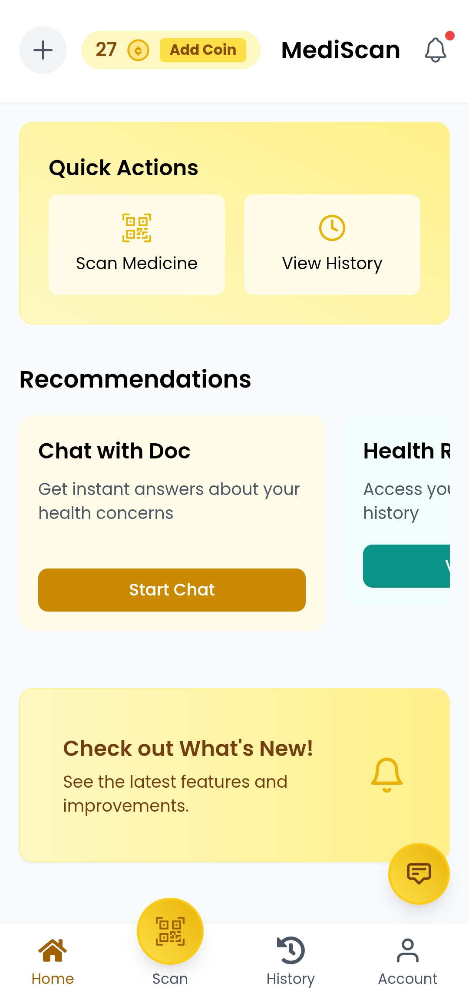

# MediScan - AI Medicine Identification App

  

  <strong>Empowering healthcare access through AI-driven medicine identification.</strong>

MediScan is an AI-powered application designed to help users quickly and accurately identify medications. This landing page showcases the app's capabilities, built with Next.js and Tailwind CSS for a modern, responsive experience.

  

## 📲 Download the App

Get started with MediScan today! Download the Android application directly:

[**Download MediScan APK**](public/MediScan.apk?raw=true)

*(Note: Ensure your device allows installation from unknown sources. This is a demo application.)*

## ✨ App Features

MediScan offers a range of features designed for ease of use and accuracy:

*   **🤖 AI-Powered Identification**: Simply snap a photo of a medicine, and our advanced AI will identify it, providing crucial information instantly.
*   **🩺 Focus on Rural Healthcare**: Specifically designed to support healthcare workers and individuals in areas with limited access to medical resources.
*   **🥇 Gold Membership**: Unlock premium features, potentially including detailed medication history, interaction checkers, and priority support (as showcased in the landing page).
*   **📜 History Tracking**: Keep a log of identified medications for easy reference (Gold feature).
*   **💬 Chat Support**: Access help and information directly within the app (Gold feature).
*   **📱 User-Friendly Interface**: Clean, intuitive design makes navigating the app simple for all users.
*   **♿ Accessibility**: Built with accessibility in mind to ensure usability for everyone.

## 🎯 Target Audience

MediScan is ideal for:

*   Rural healthcare workers needing quick medication verification.
*   Individuals in remote areas managing their or others' medications.
*   Elderly patients and their caregivers seeking assistance with medication identification.
*   Anyone needing a fast, reliable way to identify pills and medications.

## 🧰 Landing Page Technical Stack

This *landing page* is built using:

*   **Framework**: [Next.js](https://nextjs.org/)
*   **Styling**: [Tailwind CSS](https://tailwindcss.com/)
*   **Icons**: [React Icons](https://react-icons.github.io/react-icons/)
*   **Typography**: Inter font family
*   **Deployment**: Ready for deployment on Vercel or other platforms

## ⚖️ Legal Information

Please review our terms and policies:

*   [Terms of Service](/terms)
*   [Privacy Policy](/privacy)

## 📄 License

This project (the landing page) is licensed under the MIT License - see the `LICENSE` file for details.

## 👥 About the Developer

Designed and developed by Kethan VR, focusing on creating accessible healthcare technology solutions for underserved communities.

---

**Disclaimer:** MediScan is a demonstration application. It should not be used as a substitute for professional medical advice, diagnosis, or treatment. Always consult with a qualified healthcare provider for any questions regarding medical conditions or medications. In a real-world scenario, such an application would require rigorous testing, validation, and adherence to healthcare regulations.
