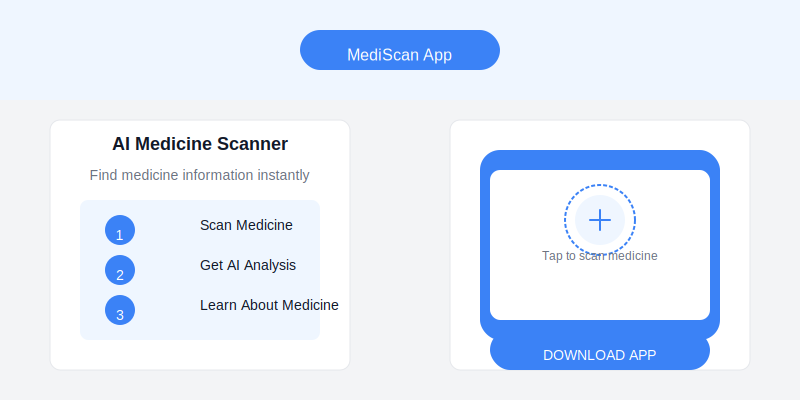

# MediScan - AI Medicine Identification App

MediScan is a responsive, mobile-focused landing page for an AI-powered medicine identification application designed to empower rural healthcare providers and individuals. This project uses Next.js and Tailwind CSS to create a modern, clean interface that highlights the app's key features.



## 🚀 Features

- **Responsive Design**: Looks great on all devices from mobile to desktop
- **Modern UI**: Clean, blue and white color scheme with medical-themed elements
- **Interactive Elements**: Buttons, testimonials, and feature highlights
- **App Screenshots**: Visual representation of the app's functionality
- **Accessibility**: ARIA labels and semantic HTML for better accessibility
- **Error Handling**: Custom error and 404 pages

## 🎯 Target Audience

- Rural healthcare workers
- Individuals in areas with limited healthcare access
- Elderly patients and their caregivers
- Healthcare professionals seeking quick medicine identification

## 🧰 Technical Stack

- **Framework**: [Next.js](https://nextjs.org/)
- **Styling**: [Tailwind CSS](https://tailwindcss.com/)
- **Icons**: [React Icons](https://react-icons.github.io/react-icons/)
- **Typography**: Inter font family
- **Deployment**: Ready for deployment on Vercel or other platforms

## 🚀 Getting Started

1. Clone this repository
2. Install dependencies:

```bash
npm install
# or
yarn install
```

3. Run the development server:

```bash
npm run dev
# or
yarn dev
```

4. Open [http://localhost:3000](http://localhost:3000) with your browser to see the result.

## 📁 Project Structure

- `/app` - Main application pages
- `/app/privacy` - Privacy policy page
- `/app/terms` - Terms of service page
- `/components` - Reusable UI components
- `/public` - Static assets including SVGs and images

## 🎨 Customization

The landing page can be easily customized by editing:

- **Colors**: Update primary colors in `globals.css` and `tailwind.config.js`
- **Content**: Modify text in the page components
- **Images**: Replace mock app screenshots in the `PlaceholderAppScreen` component
- **Logo**: Modify the `AppLogo` component

## 💡 Future Enhancements

- Add actual app download functionality
- Implement language switching for multilingual support
- Add a blog section for health and medication information
- Integrate with a medicine database API for demo purposes

## 📄 License

This project is licensed under the MIT License - see the LICENSE file for details.

## 👥 About the Developer

Designed and developed by Kethan VR, focusing on creating accessible healthcare technology solutions for underserved communities.

---

This landing page is a demonstration of a fictional product. In a real healthcare application, proper medical supervision, testing, and regulatory compliance would be required.
