# MediScan - AI Medicine Identification App

  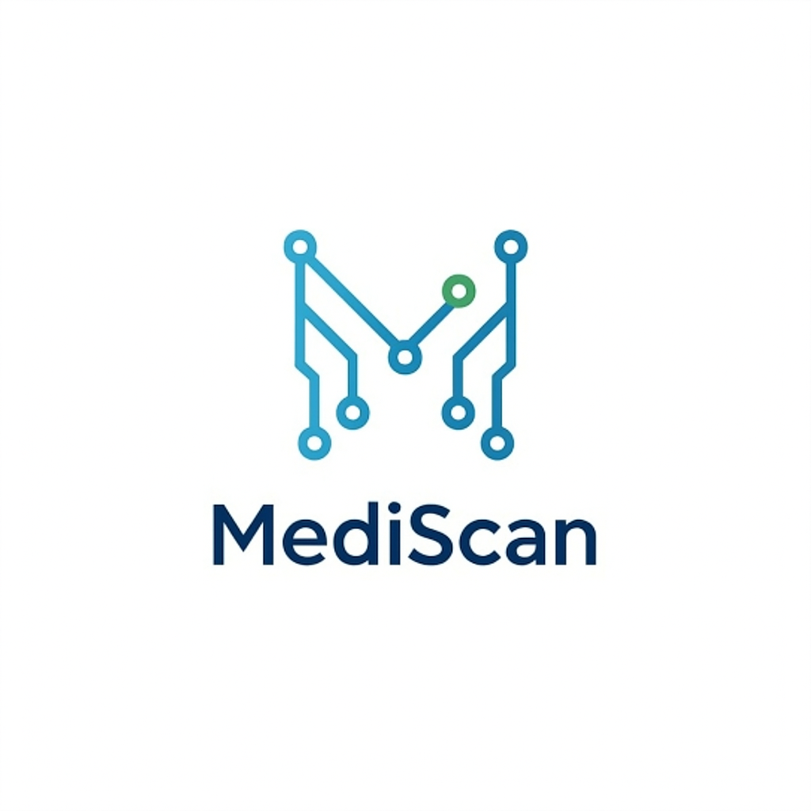

  <strong>Empowering healthcare access through AI-driven medicine identification.</strong>

  
  
  

MediScan is an AI-powered application designed to help users quickly and accurately identify medications. This landing page showcases the app's capabilities, built with Next.js and Tailwind CSS for a modern, responsive experience.

  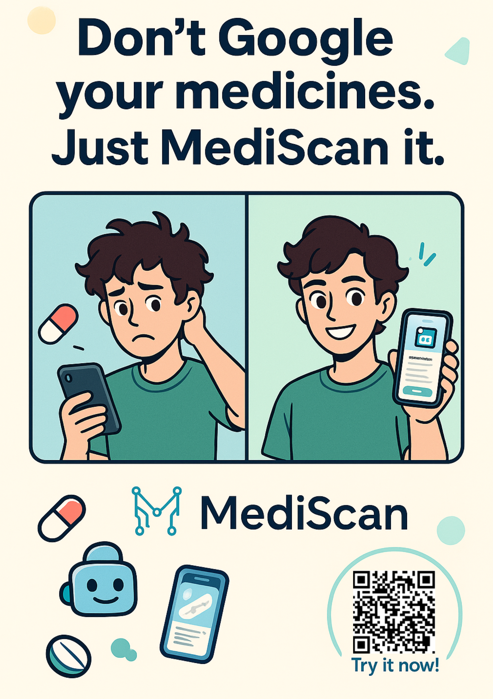
  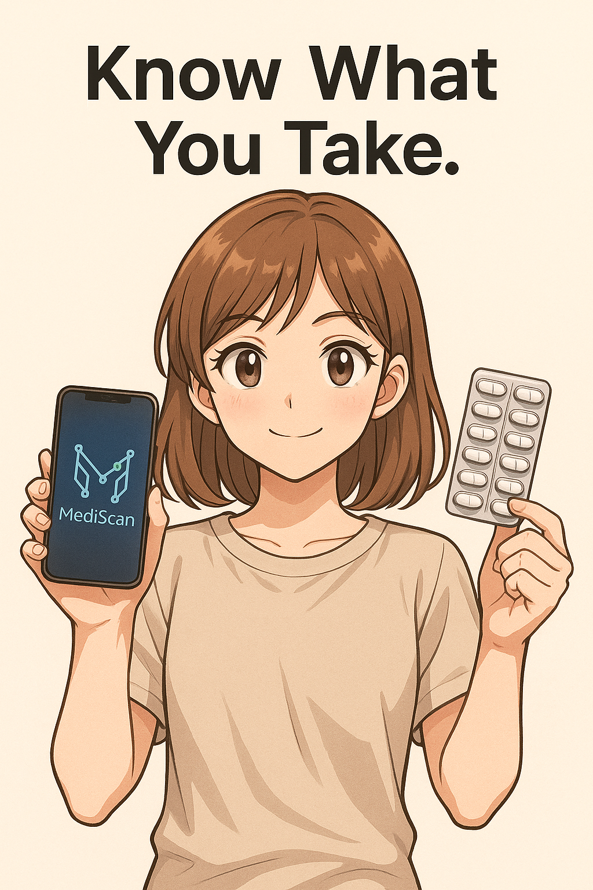
  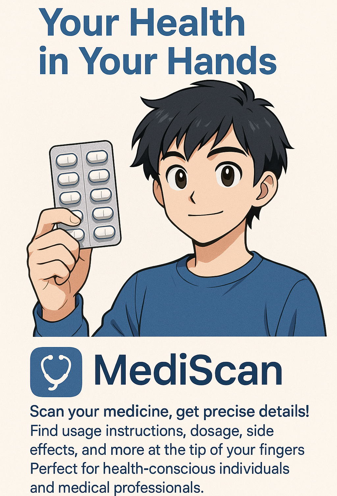

## 🎯 What is MediScan?

MediScan is a revolutionary mobile application that uses advanced artificial intelligence to identify medications from photos. The app is specifically designed to address healthcare challenges in rural and underserved areas, where access to pharmacists and medical professionals may be limited.

### 🌟 The Problem We're Solving

In rural communities worldwide:
- Limited access to healthcare professionals for medication identification
- Difficulties managing multiple medications, especially for elderly patients
- Challenges with medication adherence due to confusion about pills
- Language barriers when reading medication information

### 💡 Our Solution

MediScan provides a simple, accessible way to:
- Instantly identify medications through photo recognition
- Access important medication information in plain language
- Manage medication schedules and history
- Connect with AI-powered support for medication questions

## 📲 Download the App

Get started with MediScan today! You can download the app from our website or directly as an APK:

*   **[Visit Download Website](https://downloadmediscan.kethanvr.me)**
*   **[Download MediScan APK](public/MediScan.apk?raw=true)**

*(Note: If downloading the APK directly, ensure your device allows installation from unknown sources. This is a demo application.)*

## 📱 App Features

MediScan offers a comprehensive range of features designed for ease of use and maximum impact:

### Core Features (Free for All Users)

*   **🤖 AI-Powered Identification**: Simply snap a photo of a medicine, and our advanced AI will identify it, providing crucial information instantly.
*   **🩺 Focus on Rural Healthcare**: Specifically designed to support healthcare workers and individuals in areas with limited access to medical resources.
*   **🔍 Detailed Medication Information**: Access comprehensive details about identified medications, including usage instructions, side effects, and precautions.
*   **📱 User-Friendly Interface**: Clean, intuitive design makes navigating the app simple for all users.
*   **♿ Accessibility**: Built with accessibility in mind to ensure usability for everyone.
*   **🌐 Offline Functionality**: Basic features work without an internet connection, perfect for areas with limited connectivity.

### Premium Features (Gold Membership)

*   **🥇 Gold Membership**: Unlock premium features with our affordable subscription plan.
*   **📜 History Tracking**: Keep a comprehensive log of identified medications for easy reference.
*   **💬 AI Doc Chat**: Access 24/7 AI-powered assistance for medication questions.
*   **⚠️ Interaction Checker**: Identify potential drug interactions between multiple medications.
*   **⏰ Medication Reminders**: Set personalized reminders for taking medications.
*   **🔄 Sync Across Devices**: Access your medication data across multiple devices.
*   **🏥 Family Accounts**: Manage medications for multiple family members from one account.

## 📸 App Screenshots

<strong>Experience MediScan's intuitive interface and powerful features</strong>

| Home Page | Gold Features | Account | History | Chat | What's New |
|:---:|:---:|:---:|:---:|:---:|:---:|
| 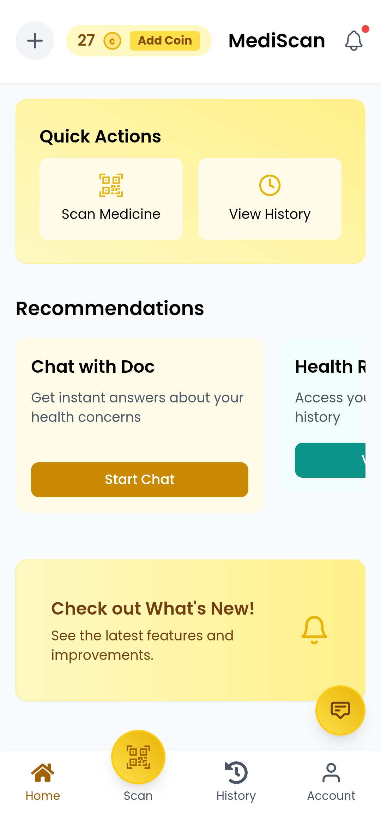 | 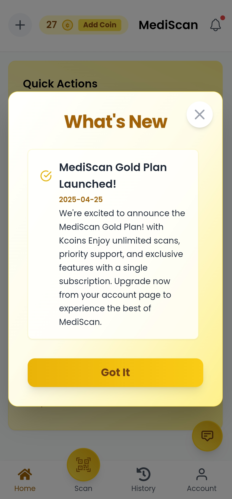 | 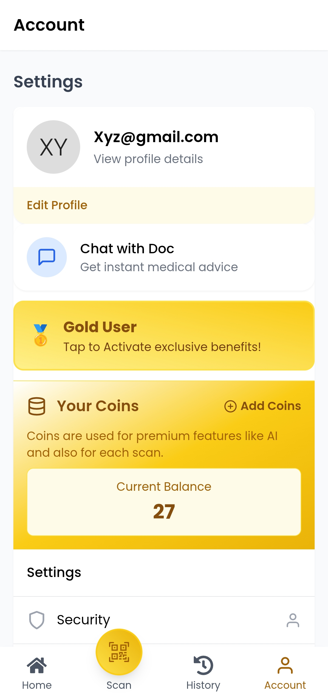 | 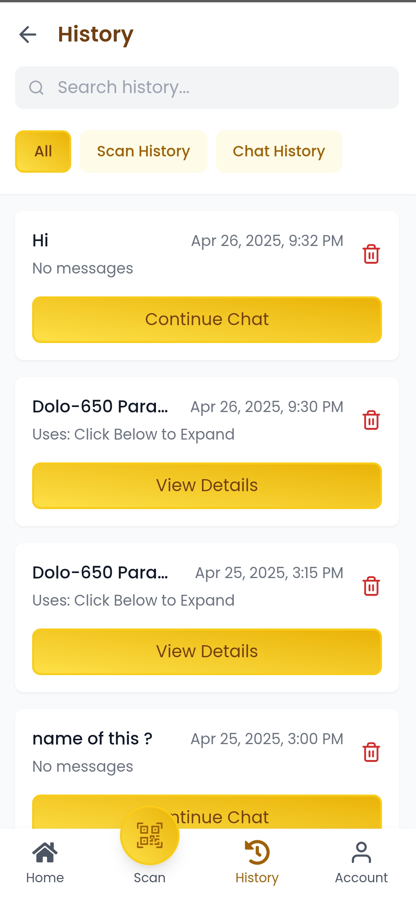 | 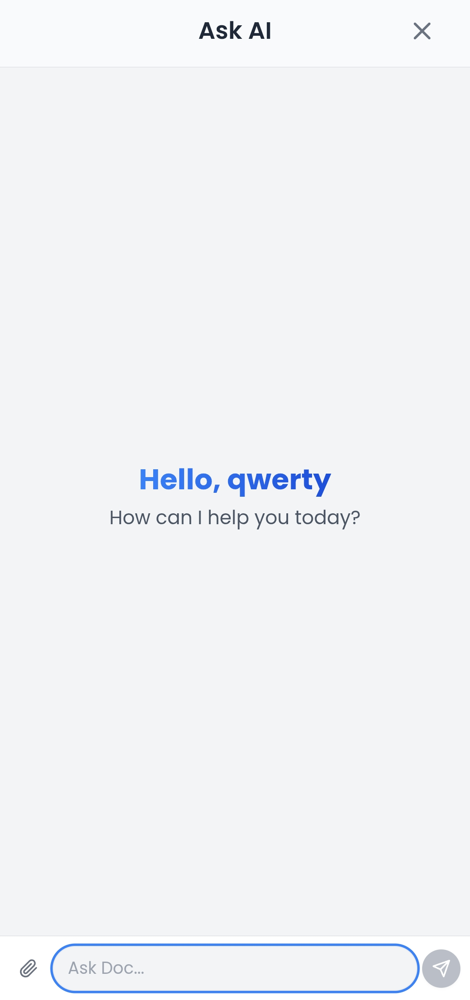 | 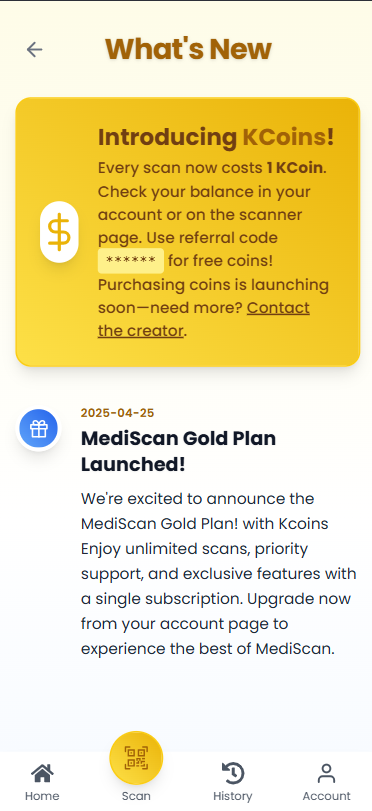 |

  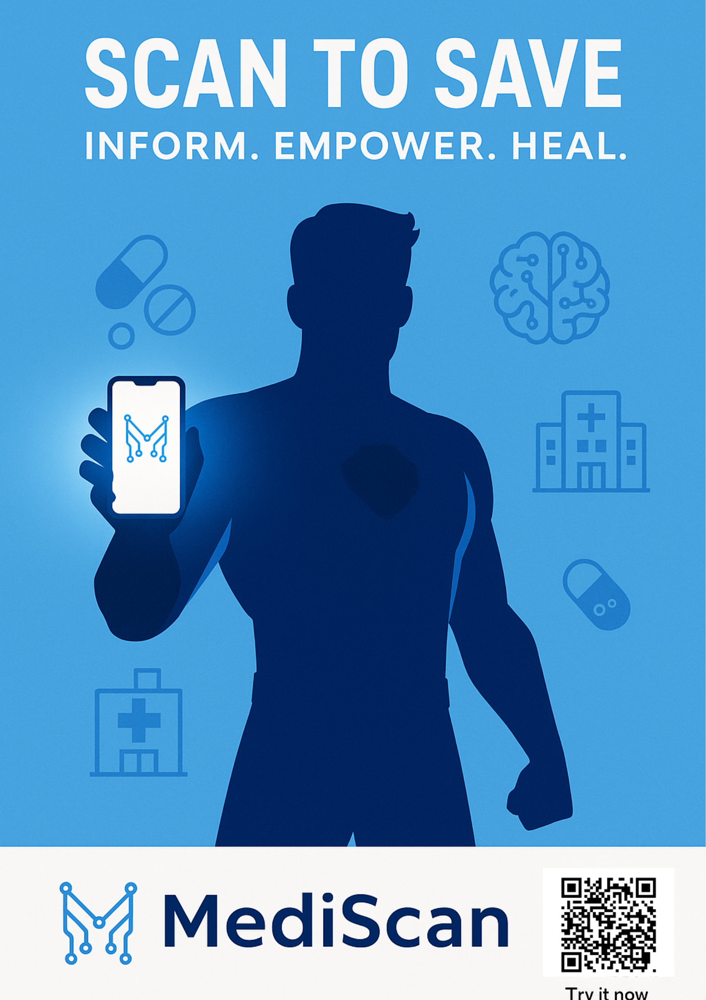
  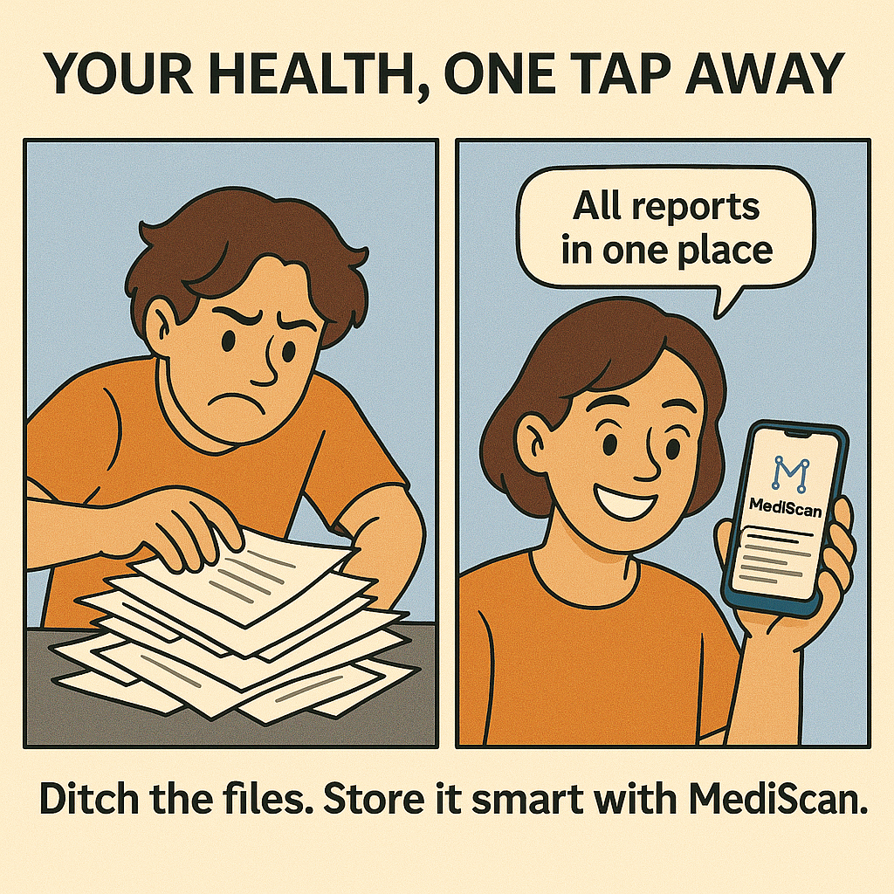
  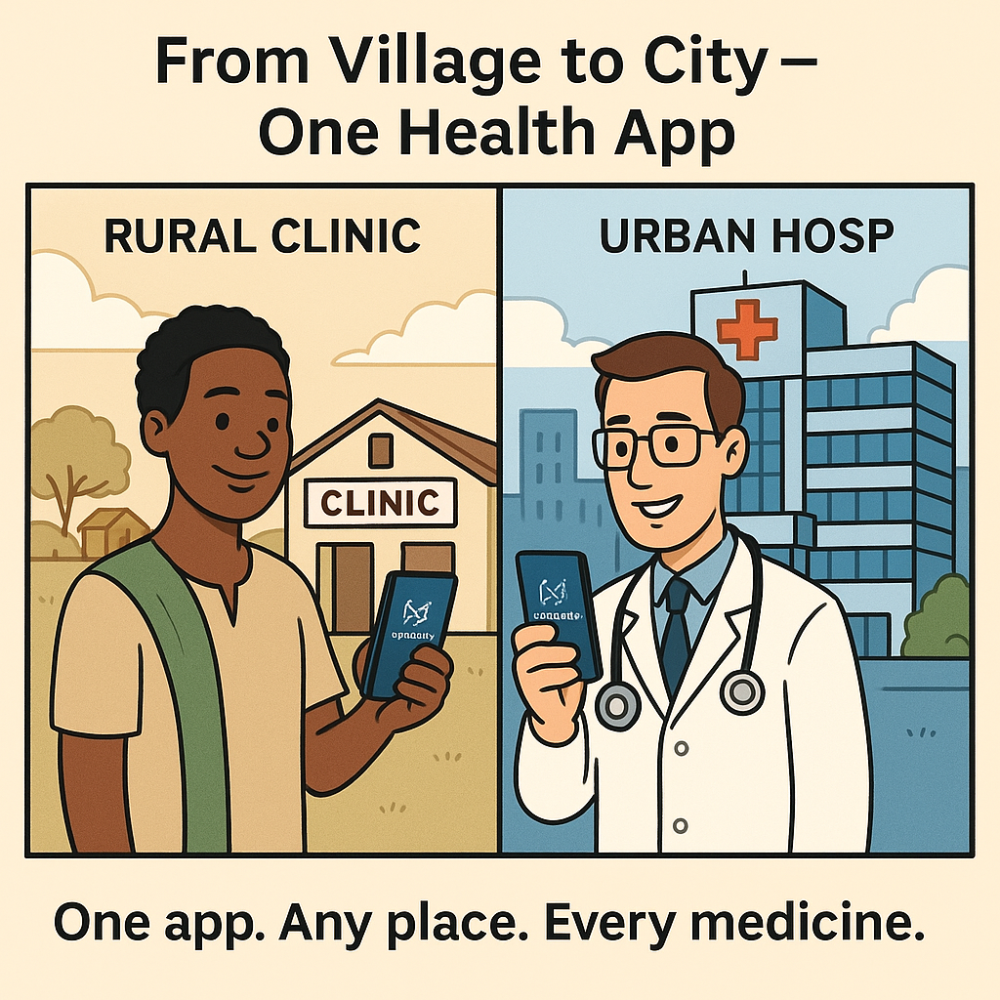

## 📲 Download MediScan

Get started with MediScan today! You can download the app from our website or directly as an APK:

  
  

*(Note: If downloading the APK directly, ensure your device allows installation from unknown sources. This is a demo application.)*

## 🎯 Who MediScan Is For

MediScan is designed to serve a diverse range of users with medication identification needs:

### Healthcare Professionals
* **Rural Healthcare Workers**: Quickly verify medications in areas with limited pharmaceutical resources
* **Community Health Workers**: Provide accurate medication information during home visits
* **Nurses and Caregivers**: Assist in medication management for multiple patients

### Individuals and Families
* **Elderly Patients**: Easily identify medications when labels are unclear or confusing
* **Caregivers**: Assist family members with proper medication identification
* **Travelers**: Identify medications when abroad or away from home healthcare providers
* **Individuals with Visual Impairments**: Get audio descriptions of medications through the app

### Community Settings
* **Rural Communities**: Access pharmaceutical knowledge where pharmacists are scarce
* **Nursing Homes**: Streamline medication management for multiple residents
* **Community Health Centers**: Support accurate medication dispensing and education

## 🧰 Technical Stack

This project leverages a modern stack for optimal performance and user experience:

### Frontend
* **Framework**: [React](https://react.dev/) with [Vite](https://vitejs.dev/) for fast development and builds
* **Styling**: [Tailwind CSS](https://tailwindcss.com/) - Utility-first CSS framework
* **Icons**: [React Icons](https://react-icons.github.io/react-icons/) - Popular icon sets as React components
* **Language**: JavaScript (JS)
* **Typography**: Inter and Baloo Bhai font families for clean, readable text
* **Animation**: Custom CSS animations for smooth, engaging user interactions

### Backend & Infrastructure
* **Backend**: [Supabase](https://supabase.com/) - Open source backend as a service (BaaS)
* **Deployment**: Vercel platform for seamless deployment and hosting
* **SEO Optimization**: Structured data, metadata, and semantic HTML for search engines
* **Performance**: Image optimization, lazy loading, and code splitting for speed
* **Accessibility**: ARIA attributes and semantic HTML for screen reader compatibility

## 🚀 Upcoming Features

Stay tuned for these exciting features coming soon:

* **⏰ Medication Reminders**: Set personalized reminders for taking medications.
* **🔄 Sync Across Devices**: Access your medication data across multiple devices.
* **🏥 Family Accounts**: Manage medications for multiple family members from one account.
* **🌐 Offline Functionality**: Basic features work without an internet connection, perfect for areas with limited connectivity.

## ⚖️ Legal Information

Please review our terms and policies:

* [Terms of Service](https://downloadmediscan.kethanvr.me/terms)
* [Privacy Policy](https://downloadmediscan.kethanvr.me/privacy)

## 📄 License

This project is licensed under the MIT License - see the `LICENSE` file for details.

## 👨‍💻 About the Developer

### Kethan VR

I'm a developer passionate about creating accessible healthcare technology solutions for underserved communities. MediScan represents my commitment to leveraging AI to solve real-world healthcare challenges.

  🏠 <a href="https://www.kethanvr.me/" target="_blank">Portfolio Website</a> 
  🔗 <a href="https://www.linkedin.com/in/kethanvr/" target="_blank">LinkedIn</a> 
  📽️ <a href="https://x.com/VrKethan" target="_blank">X (Twitter)</a> 
  📷 <a href="https://github.com/Kethanvr" target="_blank">GitHub</a>

### Get in Touch

Have questions about MediScan or interested in collaboration? Feel free to reach out through any of my social media channels or connect with me directly on [LinkedIn](https://www.linkedin.com/in/kethanvr/).

---

**Disclaimer:** MediScan is a demonstration application. It should not be used as a substitute for professional medical advice, diagnosis, or treatment. Always consult with a qualified healthcare provider for any questions regarding medical conditions or medications. In a real-world scenario, such an application would require rigorous testing, validation, and adherence to healthcare regulations.
